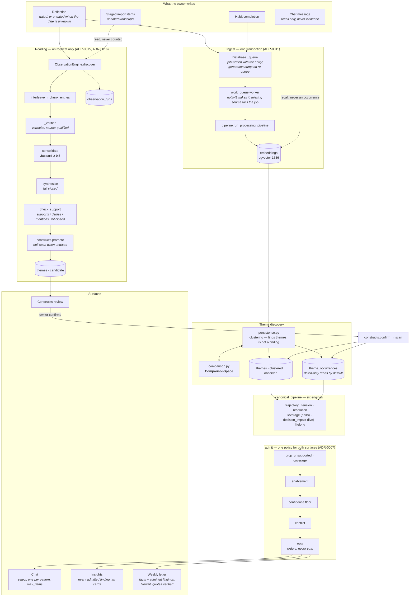
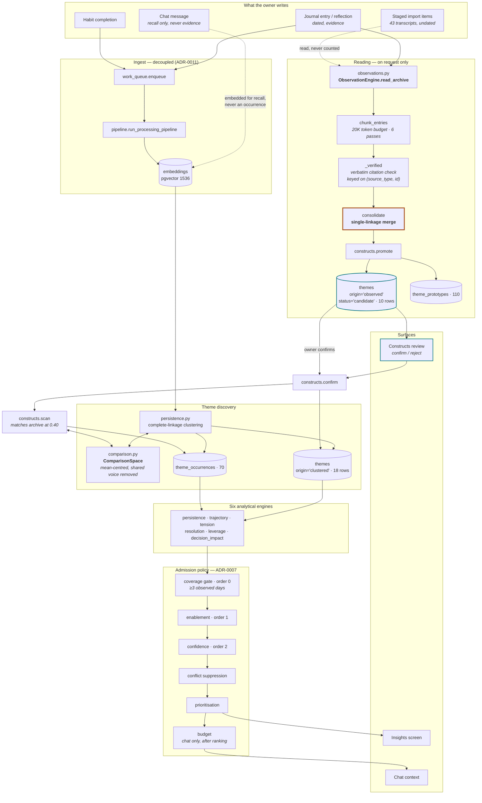

# IRIS architecture

What the code does now, then what it did on 18 September and what changed.

---

## Now

The dashed edges are what is read but never counted: chat (ADR-0003) and undated
transcripts. The candidate store reaches the review surface and nothing else.

*Verified against `agent/pipeline_orchestrator.py` (`canonical_pipeline`, `admit`),
`agent/core.py`, `agent/insights_service.py`, `agent/observations.py`,
`agent/review_letter.py`, `agent/database.py::_queue`, migrations 0012–0014.*

---

## Invariants

1. **Nothing is measured before confirmation.** The candidate store is reachable only by
   the review surface; `get_themes` filters to `status='active'`.
2. **Reading happens only when asked.** No pipeline, queue or background job reaches
   `ObservationEngine`; a test asserts the pipeline, chat core, orchestrator and insights
   service cannot import it.

---

## Before — 18 September

The system as it was when `docs/constructs-review.md` was written. The rust border was the
defect: `consolidate` merged on a single shared citation. Chat and Insights also admitted
findings through different code; that is not drawn here.

**Reading the diagram.** `get_themes` returns only `status='active'`, so the candidate
store (`TC`) reaches the review surface and *nothing else* — no engine can see it until
the owner confirms. The dashed edges are the two things that are read but never counted:
chat messages (ADR-0003) and undated transcripts. The thick rust border marks the
defect: `consolidate` merges on a single shared citation.

### What changed

*Status as of 2026-09-19.*

| Change | Why (at the time) | Status |
|---|---|---|
| `consolidate` → complete-linkage or minimum overlap | Single-linkage chaining merged unrelated findings; 6 of 10 candidates ended less coherent than the 0.40 bar an entry must clear to join them. | Done — minimum overlap (Jaccard ≥ 0.5); complete linkage was tested and fails the bridge case |
| **New:** cohesion check before promotion | A candidate whose own prototypes fail its own admission test should never reach review. Catches the failure at the point it happens rather than after confirmation. | Not built — the measure it rested on compared the wrong statistics (see the erratum) |
| `chunk_entries` interleaves sources | Today passes 3–6 are recordings only, so a journal-and-voice pattern has one chance in six. | Done — `interleave`, dated by date with undated spread through |
| `promote` carries a null span when undated | Four candidates are stamped `2026-09-18`, implying transcripts were written the day they were discovered. | Done — `span_is_undated` (migration 0011) |
| **New:** `observation_runs` table | Nothing currently records how many raw observations preceded a merge, so the merge's behaviour can only be inferred from its output. | Done — runs, passes, raw pre-merge output (ADR-0016) |
| `origin` exposed on the insight payload | A confirmed construct is presently indistinguishable from a generated cluster on screen, which defeats the point of the owner vouching for it. | Done — on the payload and on the card |
